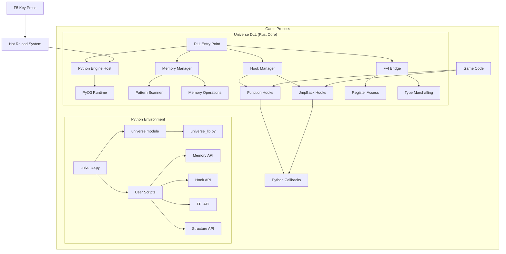
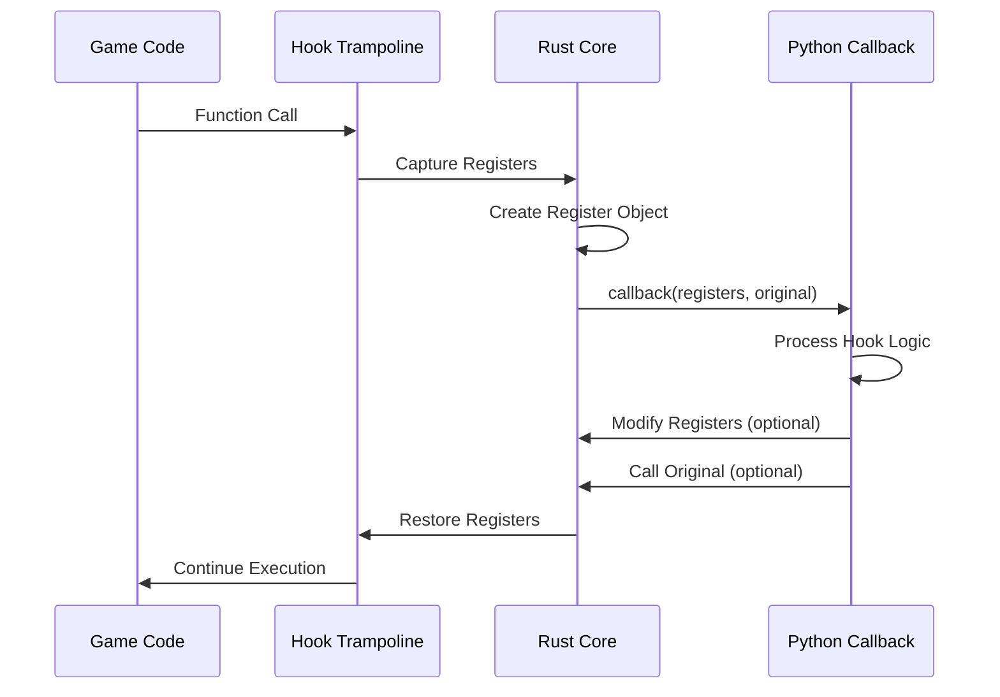
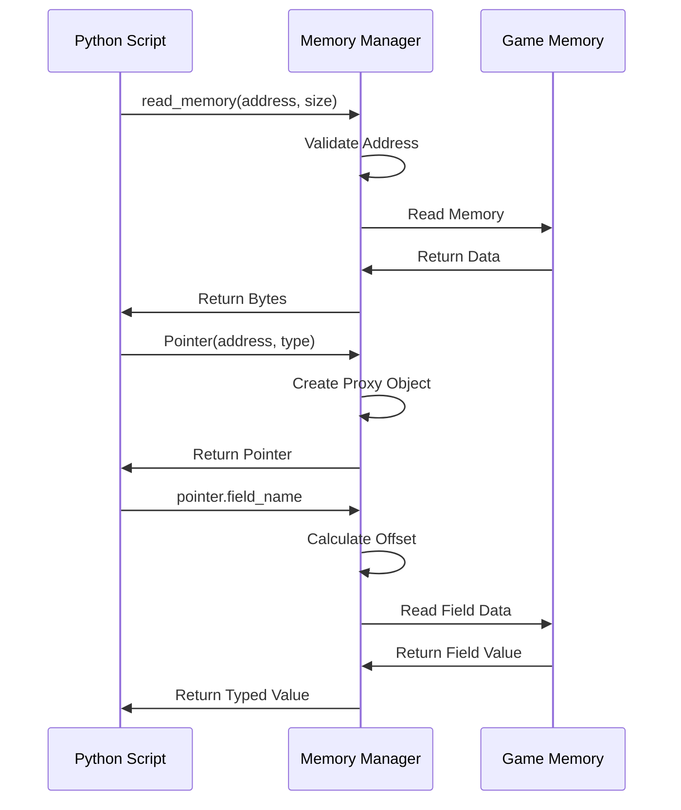
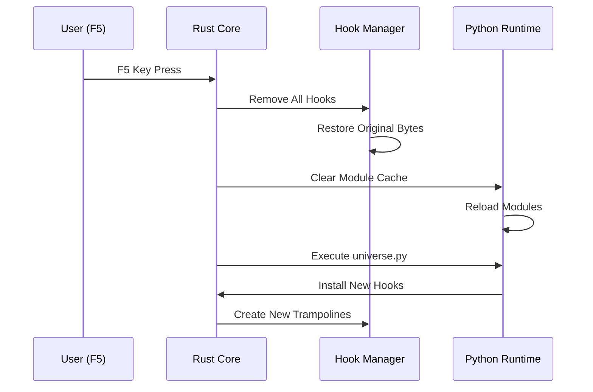

# Design Document

## Overview

The Universe modding framework is architected as a two-tier system: a high-performance Rust DLL core that handles low-level game interactions, and an embedded Python scripting environment that provides a user-friendly modding interface. The design emphasizes safety, performance, and ease of use while maintaining game-engine agnosticism.

The core philosophy centers around providing a safe abstraction layer between user scripts and dangerous memory operations, while maintaining the flexibility needed for complex game modifications.

## Architecture

### System Components



### Core Architecture Principles

1. **Separation of Concerns**: Rust handles unsafe operations, Python provides user interface
2. **Memory Safety**: All memory operations go through validated Rust abstractions
3. **Thread Safety**: Careful synchronization between game threads and Python execution
4. **Performance**: Minimal overhead for hook execution and memory operations
5. **Reliability**: Graceful error handling that never crashes the host game

## Components and Interfaces

### 1. DLL Entry Point and Lifecycle

**Purpose**: Manages the DLL injection lifecycle and coordinates system initialization.

**Key Responsibilities**:
- Handle DLL_PROCESS_ATTACH and DLL_PROCESS_DETACH events
- Initialize the Python runtime and universe module
- Set up global key handlers (F5 for hot reload)
- Coordinate graceful shutdown and cleanup

**Interface Design**:
```rust
// Core lifecycle management
pub struct UniverseCore {
    python_runtime: PyO3Runtime,
    hook_manager: HookManager,
    memory_manager: MemoryManager,
    hot_reload_handler: HotReloadHandler,
}

impl UniverseCore {
    pub fn initialize() -> Result<Self, UniverseError>;
    pub fn shutdown(&mut self) -> Result<(), UniverseError>;
    pub fn handle_hot_reload(&mut self) -> Result<(), UniverseError>;
}
```

### 2. Python Engine Host

**Purpose**: Embeds and manages the CPython interpreter using PyO3.

**Key Responsibilities**:
- Initialize CPython interpreter with proper threading configuration
- Create and expose the `universe` module to Python
- Handle Python exception propagation and logging
- Manage module reloading for hot-reload functionality

**Design Considerations**:
- Use PyO3's `prepare_freethreaded_python()` for thread safety
- Implement custom module finder for game directory Python files
- Maintain Python GIL (Global Interpreter Lock) discipline
- Handle Python interpreter state during hot reloads

**Interface Design**:
```rust
pub struct PyO3Runtime {
    interpreter: Python<'static>,
    universe_module: PyObject,
    user_modules: HashMap<String, PyObject>,
}

impl PyO3Runtime {
    pub fn initialize() -> PyResult<Self>;
    pub fn execute_universe_py(&self) -> PyResult<()>;
    pub fn reload_modules(&mut self) -> PyResult<()>;
    pub fn handle_exception(&self, error: PyErr);
}
```

### 3. Memory Manager

**Purpose**: Provides safe memory access abstractions for the Python environment.

**Key Responsibilities**:
- Validate memory addresses before access
- Handle access violations gracefully
- Implement pattern scanning across loaded modules
- Provide efficient memory read/write operations

**Safety Mechanisms**:
- Virtual memory query to validate address ranges
- Exception handling for access violations
- Bounds checking for buffer operations
- Module enumeration for pattern scanning scope

**Interface Design**:
```rust
pub struct MemoryManager {
    process_handle: HANDLE,
    loaded_modules: HashMap<String, ModuleInfo>,
}

impl MemoryManager {
    pub fn read_memory(&self, address: usize, size: usize) -> Result<Vec<u8>, MemoryError>;
    pub fn write_memory(&self, address: usize, data: &[u8]) -> Result<(), MemoryError>;
    pub fn pattern_scan(&self, module: &str, pattern: &[u8], mask: &str) -> Option<usize>;
    pub fn is_valid_address(&self, address: usize) -> bool;
}
```

### 4. Hook Manager

**Purpose**: Manages function hooking using trampoline techniques for both function entry and mid-function hooks.

**Key Responsibilities**:
- Install and remove function hooks and jmpback hooks
- Manage trampoline generation and original function preservation
- Handle hook callback execution with proper register marshalling
- Maintain thread safety during hook operations

**Hook Types**:

1. **Function Hooks**: Installed at function entry points
   - Create trampoline to preserve original function
   - Pass `(registers, original_function)` to Python callback
   - Allow callback to decide whether to call original

2. **JmpBack Hooks**: Installed at arbitrary code locations
   - Execute callback and return to original location
   - Pass only `(registers)` to Python callback
   - Simpler implementation without original function preservation

**Interface Design**:
```rust
pub struct HookManager {
    active_hooks: HashMap<usize, HookInfo>,
    trampoline_allocator: TrampolineAllocator,
}

pub enum HookType {
    Function { original_bytes: Vec<u8>, trampoline: usize },
    JmpBack { original_bytes: Vec<u8> },
}

impl HookManager {
    pub fn install_function_hook(&mut self, address: usize, callback: PyObject) -> Result<(), HookError>;
    pub fn install_jmpback_hook(&mut self, address: usize, callback: PyObject) -> Result<(), HookError>;
    pub fn remove_hook(&mut self, address: usize) -> Result<(), HookError>;
    pub fn remove_all_hooks(&mut self) -> Result<(), HookError>;
}
```

### 5. Register Access System

**Purpose**: Provides Python access to CPU register state during hook execution.

**Key Responsibilities**:
- Capture register state when hooks are triggered
- Allow Python callbacks to read and modify register values
- Restore modified register state for continued execution
- Support both general-purpose and floating-point registers

**Register State Management**:
- Capture full x64 register context using Windows CONTEXT structure
- Provide Python object interface for register access
- Handle register modifications atomically
- Support register state validation

**Interface Design**:
```rust
#[repr(C)]
pub struct RegisterState {
    pub rax: u64, pub rbx: u64, pub rcx: u64, pub rdx: u64,
    pub rsi: u64, pub rdi: u64, pub rsp: u64, pub rbp: u64,
    pub r8: u64, pub r9: u64, pub r10: u64, pub r11: u64,
    pub r12: u64, pub r13: u64, pub r14: u64, pub r15: u64,
    pub xmm: [u128; 16],
}

impl RegisterState {
    pub fn capture() -> Self;
    pub fn restore(&self);
    pub fn to_python_object(&self) -> PyObject;
}
```

### 6. FFI Bridge

**Purpose**: Enables Python to call arbitrary native functions with proper type marshalling.

**Key Responsibilities**:
- Create callable Python objects from memory addresses
- Handle argument marshalling from Python to native types
- Support multiple calling conventions (stdcall, cdecl, fastcall)
- Manage return value marshalling back to Python

**Type System**:
- Support basic types: integers, floats, pointers, strings
- Handle complex types through structure definitions
- Provide calling convention abstraction
- Implement safe function pointer validation

**Interface Design**:
```rust
pub struct FFIBridge {
    function_cache: HashMap<usize, FunctionInfo>,
}

pub struct FunctionInfo {
    address: usize,
    arg_types: Vec<NativeType>,
    return_type: NativeType,
    calling_convention: CallingConvention,
}

impl FFIBridge {
    pub fn create_function(&mut self, info: FunctionInfo) -> PyObject;
    pub fn call_function(&self, address: usize, args: &[PyObject]) -> PyResult<PyObject>;
}
```

### 7. Pointer System

**Purpose**: Provides unified interface for accessing both basic types and complex structures in memory.

**Key Responsibilities**:
- Create typed pointers for basic data types (int, float, string)
- Support custom structure definitions with field offset calculation
- Handle automatic serialization/deserialization
- Provide both direct access and proxy object interfaces

**Pointer Types**:

1. **Basic Type Pointers**: Direct access to primitive types
   - `Pointer(address, int)` for integer access
   - `Pointer(address, float)` for floating-point access
   - `Pointer(address, str)` for string access

2. **Structure Pointers**: Proxy objects for complex data layouts
   - Dynamic field offset calculation
   - Automatic type conversion
   - Nested structure support

**Interface Design**:
```rust
pub enum PointerType {
    Basic(BasicType),
    Structure(StructureDefinition),
}

pub struct PointerManager {
    type_registry: HashMap<String, StructureDefinition>,
}

impl PointerManager {
    pub fn create_pointer(&self, address: usize, pointer_type: PointerType) -> PyObject;
    pub fn register_structure(&mut self, name: String, definition: StructureDefinition);
}
```

## Data Models

### Hook Execution Flow



### Memory Access Pattern



### Hot Reload Sequence



## Error Handling

### Error Categories

1. **Memory Errors**: Invalid addresses, access violations, buffer overflows
2. **Hook Errors**: Failed installations, trampoline allocation failures
3. **Python Errors**: Script exceptions, import failures, callback errors
4. **FFI Errors**: Invalid function signatures, calling convention mismatches

### Error Handling Strategy

- **Graceful Degradation**: Never crash the host game
- **Comprehensive Logging**: All errors logged to universe.log with context
- **Error Propagation**: Python exceptions for user-facing errors
- **Recovery Mechanisms**: Automatic cleanup on critical failures

### Error Types

```rust
#[derive(Debug)]
pub enum UniverseError {
    Memory(MemoryError),
    Hook(HookError),
    Python(PyErr),
    FFI(FFIError),
    System(SystemError),
}

impl UniverseError {
    pub fn log_error(&self);
    pub fn to_python_exception(&self) -> PyErr;
    pub fn is_recoverable(&self) -> bool;
}
```

## Performance Considerations

### Optimization Strategies

1. **Hook Overhead Minimization**:
   - Efficient trampoline generation
   - Minimal register state capture
   - Fast Python callback invocation

2. **Memory Access Optimization**:
   - Cached module information
   - Efficient pattern scanning algorithms
   - Minimal memory validation overhead

3. **Python Integration**:
   - GIL management optimization
   - Efficient type conversion
   - Module caching strategies

This design provides a comprehensive foundation for implementing the Universe modding framework while maintaining safety, performance, and usability requirements.